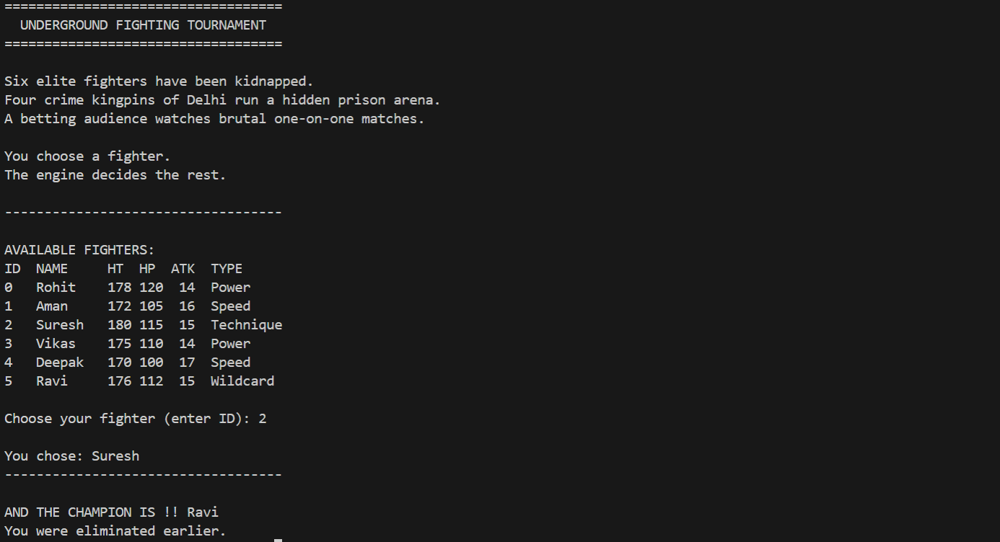

# Tournament Engine (Go)

A CLI-based underground fighting **tournament simulation engine** built in **Golang**.

The primary goal of this project was **not** to build a game, but to deeply understand and apply **Go concurrency, parallelism, and clean engine design** in a realistic simulation setting.

---

## Why this project?

I built this project to:

- Understand **goroutines and channels** beyond toy examples
- Learn how to safely run **parallel tasks** without shared-state bugs
- Design a **deterministic simulation engine with controlled randomness**
- Practice **clean architecture** (engine vs CLI vs utilities)

Instead of artificial examples, I chose a **tournament simulation** because it naturally maps to:

- independent tasks (parallel fights)
- fan-out / fan-in concurrency patterns
- probabilistic outcomes
- real-world systems like workers, schedulers, and simulations

---

## Core Idea

- A set of fighters compete in a knockout tournament
- Each round runs **multiple fights in parallel**
- Fights are **fully auto-simulated**
- The user only chooses a fighter at the start
- The engine controls everything else

This keeps the system:

- fair
- reproducible
- engine-driven rather than input-driven

---

## Concurrency Design

The key technical focus is **parallel fights per round**.

- Each fight runs in its own goroutine
- Results are collected via channels (fan-in)
- No shared mutable state between goroutines
- Each fight has its own RNG instance to avoid race conditions

This mirrors real backend patterns such as:

- worker pools
- batch processors
- simulation engines
- task execution pipelines

---

## Randomness & Determinism

- Randomness is **injected**, not global
- Each fight uses an isolated `rand.Rand`
- This avoids concurrency issues and enables reproducibility
- The design allows deterministic runs via seeds (easy extension)

---

## Game Mechanics (High Level)

- Fighters belong to combat archetypes (Power / Speed / Technique / Wildcard)
- Archetypes follow a Rock–Paper–Scissors–style dominance system
- Advantage affects damage output
- Special moves trigger probabilistically
- Winners may receive controlled upgrades
- Odd-numbered rounds are handled via byes (no crashes)

No fantasy powers — everything is grounded and numeric.

---

## Story Context (for depth, not gameplay)

To add some flavor without polluting the engine:

> Six elite fighters are kidnapped by four wealthy crime kingpins of Delhi  
> and forced to fight in a hidden underground prison arena.  
> A betting audience watches brutal one-on-one matches.

The characters intentionally use **common Delhi-style names** to keep things grounded and slightly humorous.

The story lives **only in the CLI layer** — the engine remains pure and reusable.

---

## Project Structure

cmd/
tournament/ → CLI entrypoint (story, input, output)

internal/
model/ → core data structures
engine/ → fight logic, rounds, tournament orchestration
util/ → RNG utilities

This separation ensures the engine can later be reused for:

- batch simulations
- analytics
- services
- or non-CLI interfaces

---

## Sample Run



## How to Run

From the project root:

```bash
go run ./cmd/tournament
```

Or build a binary:

```bash
go build -o tournament ./cmd/tournament
./tournament
```

## What I Learned

- Go concurrency is powerful only when used deliberately
- Randomness must be isolated in concurrent systems
- Simulation bias (e.g. first-mover advantage) is real and subtle
- Clean architecture makes debugging and evolution easier
- Engine-first thinking scales better than UI-first thinking

---

## Future Extensions (Optional)

- Deterministic seed mode (`--seed`)
- Large-scale Monte Carlo simulations
- Worker pool–based execution
- Structured JSON output for analytics

---

## Final Note

This project intentionally stops at a **stable, balanced, and correct engine**.

The goal was depth of understanding, not feature bloat.
